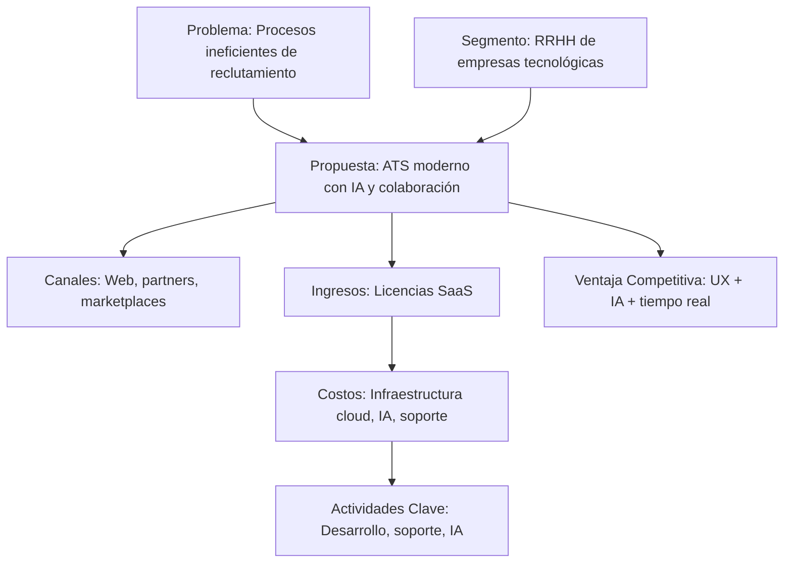
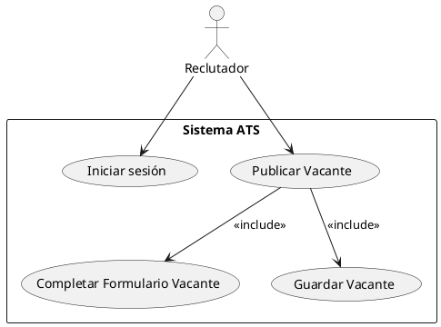
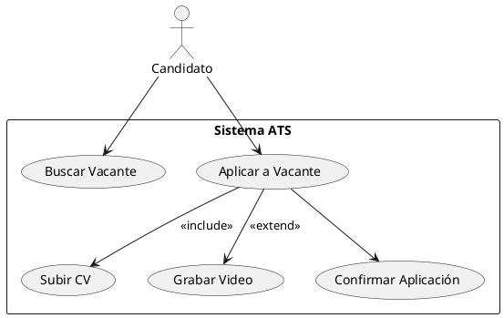
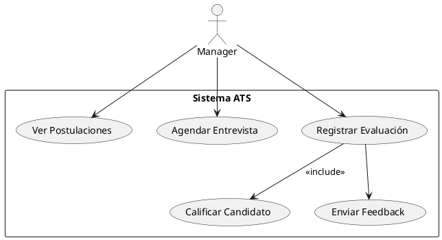
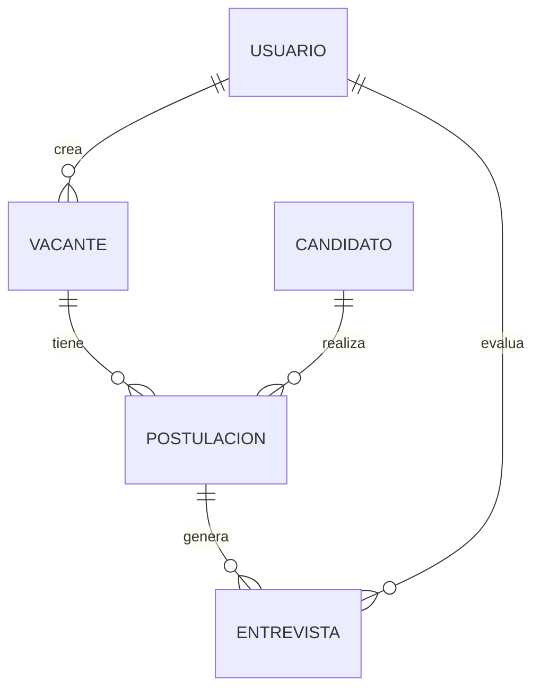
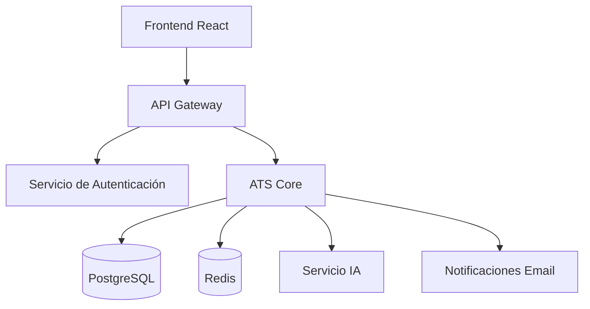
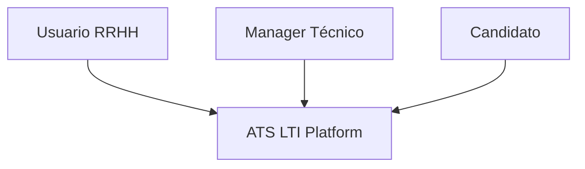
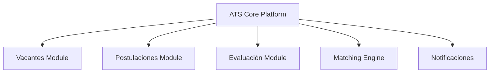

# LTI-AG

## Descripción del Software LTI

**LTI** (Lean Talent Intelligence) es un sistema ATS (Applicant Tracking System) de nueva generación enfocado en potenciar la eficiencia de los departamentos de recursos humanos mediante automatización, colaboración en tiempo real y asistentes de IA. 

### Valor Añadido
- Automatización de tareas repetitivas (filtrado, programación de entrevistas)
- Asistencia de IA en redacción de vacantes, screening de CVs y feedback
- Colaboración entre reclutadores y managers en tiempo real
- Evaluaciones multimedia (entrevistas en video)
- Trazabilidad completa del proceso de selección

### Ventajas Competitivas
- Integración de IA nativa
- Experiencia de usuario moderna
- Modularidad y escalabilidad
- Enfoque colaborativo y analítico

---

## Funciones Principales

- Publicación de vacantes con asistentes IA
- Portal de candidatos para aplicar y subir CVs/videos
- Matching inteligente entre vacantes y candidatos
- Agendamiento de entrevistas automatizado
- Evaluación colaborativa con feedback estructurado
- Integración con herramientas externas (correo, calendario, CRM)
- Panel analítico en tiempo real de métricas de reclutamiento

---

## Lean Canvas



---

## Casos de Uso

### 1. Publicar Vacante


### 2. Postulación de Candidato


### 3. Evaluación y Feedback


---

## Modelo de Datos

### Entidades y Atributos

| Entidad     | Atributo               | Tipo          |
|-------------|------------------------|---------------|
| Usuario     | id_usuario             | UUID          |
|             | nombre                 | VARCHAR(100)  |
|             | email                  | VARCHAR(150)  |
|             | rol                    | ENUM          |
| Vacante     | id_vacante             | UUID          |
|             | titulo                 | VARCHAR(100)  |
|             | descripcion            | TEXT          |
|             | fecha_creacion         | DATE          |
| Postulación | id_postulacion         | UUID          |
|             | id_candidato           | UUID          |
|             | id_vacante             | UUID          |
|             | estado                 | ENUM          |
| Entrevista  | id_entrevista          | UUID          |
|             | fecha                  | TIMESTAMP     |
|             | evaluador              | UUID          |

### Relaciones



---

## Diseño del Sistema a Alto Nivel

El sistema sigue una arquitectura basada en microservicios con integración de componentes IA y almacenamiento distribuido. Un frontend en React se conecta a una API Gateway que enruta las solicitudes a los diferentes servicios, incluyendo autenticación, core ATS, motor IA y servicios externos.



---

## Diagrama C4

### Nivel 1 - Contexto


### Nivel 2 - Contenedores
```mermaid
graph TD
  ATS[ATS Core Platform]
  Auth[Servicio de Autenticación]
  API[API Gateway]
  FE[Frontend React]
  DB[(PostgreSQL)]
  Redis[(Redis)]
  IA[Servicio IA (OpenAI)]

  ATS --> DB
  ATS --> Redis
  ATS --> IA
  API --> ATS
  FE --> API
  Auth --> DB
```

### Nivel 3 - Componentes Internos
